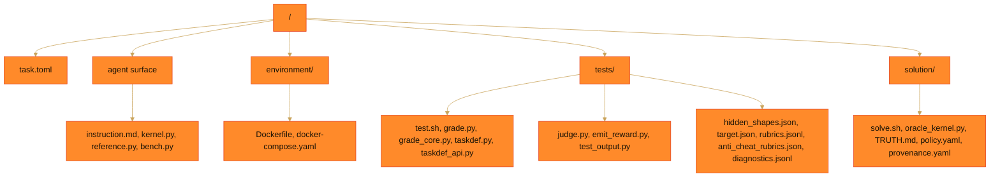

[](images/banner.png)

> [](https://github.com/Ethara-Ai/harbor)
> 
> 
> 
> 

Public sample of the hephaestus dataset: promoted Harbor bundles over the hephaestus GPU kernel-optimization environment, one directory per promoted uuid. **One bundle is published here; the release target is 30.** Each bundle is content-addressed and self-contained — pinned image digest, hidden shape set, verifier and oracle travel together.

## What hephaestus is

Hephaestus is a verifiable reinforcement-learning environment in which a model is handed a PyTorch reference operator and a deliberately slow starter kernel, and has to turn it into a Triton kernel that matches the reference inside disclosed tolerances and beats the production implementation it is timed against. There is no rubric to argue with and no string to read off: the score is wall-clock device time on one H100, measured against a real vendor-library composition — for the sample bundle, a CUTLASS grouped GEMM via `torch._grouped_mm` — on a hidden shape set the model never sees. The agent works an iterative loop, editing `kernel.py` and running the local harness, for up to 100 attempts inside a 90-minute budget, and only the best submission counts.

The environment is adversarial by construction. Every obvious shortcut is closed before the model starts: it cannot call the library it is being raced against, it cannot wrap one and claim the time, it cannot tune to the shapes it can see, and it cannot reach the process that writes its reward.

## Key terms

- **Bundle**: one self-contained Harbor task, content-addressed from its own material, whose UUID is a hash of the frozen bytes. Trajectories are excluded from that hash, so recording a rollout never changes a bundle's identity.
- **Production anchor**: the denominator of the score — a real, tuned implementation of the same operator built from vendor libraries. The agent must beat the stack it is forbidden from importing.
- **Written-kernel gate**: at least 60% of graded forward+backward device time must land inside `@triton.jit` kernels the candidate module itself declares. Kernel names are matched against that declared set and rejected outright if they carry a `cutlass`/`cublas`/`cudnn`/`nvjet` marker or an architecture prefix, so a library call cannot be laundered into a written kernel.
- **Hidden shape set**: the shapes the score is actually computed on. The agent tunes against a small published set; grading happens on held-out shapes and dtypes, with input magnitudes and expert-popularity priors redrawn per invocation, so a lookup table for the visible shapes is worth nothing.
- **Oracle**: a from-scratch solution shipped in `solution/`, never staged to the agent, whose only job is to prove full reward is reachable through every live gate. Difficulty is calibrated by a working solve, not by an authored number.

## How a bundle is scored

A submission produces one float in `[0, 1]`, and it is **zero unless every gate passes**. The pass/fail gates are settled before a stopwatch is ever started:

| Check | What it decides |
|---|---|
| `G0_trusted_entrypoint` | The verifier, not the candidate, is the last writer of the reward. |
| `G1_forbidden` | Forbidden-symbol scan over the comment-stripped source (`torch._grouped_mm`, `vllm`, `sglang`, `grouped_gemm`, `transformer_engine`, `flashinfer`). A near-duplicate containment check against a vendored reference library runs under the same gate for bundles that ship one; this bundle's anchor is a torch builtin, so it records `available: false` and gates nothing here. |
| `G2_correctness` | Output **and all four gradients** inside the disclosed per-dtype tolerances (`2e-4` fp32, `4.5e-2` bf16) on the hidden shapes, across a five-stage harness — smoke, shape sweep, numerical stability under adversarial inputs, determinism, and non-power-of-two / exact-tie edge cases. |
| `G4_written_kernel` | Written-kernel adoption ≥ 60%. Deliberately evaluated *before* timing: a library wrapper is disqualified without ever earning a number. |
| `G3_speed` | Honest timing — CUDA-event clock, discarded warmups, full forward+backward inside the timed region, measured on the shipped bytes. |
| `process_deterministic` | Recorded and explicitly **non-gating**. A candidate that legitimately fails a gate must be scored zero, not discarded as a verifier error. |
| `rubric_judge` | The cross-family LLM panel. Asymmetric: it can never raise a score, and a decided rubric failure sets it to zero. |

Correctness is measured against the reference within tolerance; bitwise equality is required in only one place — the determinism stage, where the same input is replayed three times and the output plus all four gradients must come back identical to each other.

`G3_speed` is the measurement, and it only happens if everything above it survived:

```
score = geomean over hidden shapes of  min( production_time / candidate_time , 1 )
```

In plain terms: on each hidden shape the candidate scores production's time divided by its own. Match production and that shape scores `1.0`; take twice as long and it scores `0.5`. Parity is the ceiling — beating production earns nothing extra, because the point is to reach a real vendor implementation, not to overfit past it. The per-shape fractions are combined with a geometric mean, so one catastrophic shape drags the whole score down instead of being averaged away by good ones.

For the sample bundle the shipped starter scores **0.083**, meaning it is about **12× slower** than production. The informational frontier reference is **0.34** — roughly **3× slower**. The score is that raw fraction; it is never divided by the reference, and the reference gates nothing.

Alongside the scalar, a cross-family LLM panel votes on 14 rubrics covering routing semantics, precision policy, full dispatch, determinism, and nine enumerated anti-cheat behaviours — result memoization, call-count shortcuts, timing-context detection, value-dependent dispatch, judge manipulation, and so on. A vote only counts if the evidence it quotes is verified to exist in the source or the trajectory. If the panel is unreachable the run is recorded as not-a-trial rather than scored zero, and no model judges a solver from its own family.

## Bundle layout

Each promoted bundle is a Harbor task.



The private boundary is exact and enforced by the image: only `instruction.md`, `kernel.py`, `reference.py` and `bench.py` are copied into the agent workspace. `tests/` and `solution/` are never staged. Of the four staged files, only `kernel.py` is editable.

## Promoted bundles

| uuid | task | surface | production anchor |
|---|---|---|---|
| [`be565a72`](be565a72-15c0-5164-ba9f-6a854ef69db9) | `hephaestus/moe_routed_fwdbwd` | forward + backward | `torch._grouped_mm` (CUTLASS grouped GEMM) |

Rows land as bundles are promoted; the release target is 30. Bundles are drawn from the operator families where LLM runtime actually goes — routed mixture-of-experts, gated-delta, and their fused forward+backward surfaces. Anchors differ per family: this one is timed against a torch-native CUTLASS composition, while the gated-delta bundles are timed against a vendored reference kernel installed into the image.

## Difficulty

The declared hardness axis is closed at three — **Baseline** (the blocking floor every task realizes), **Hard** (the default target), and **Frontier-defeat** (the ambition tier that composes difficulty across axes). A declared tier is an authored intent and is never difficulty evidence. Measured difficulty enters only through an external signed pilot against a frozen solver registry; until that lands, this release claims no measured pass rate and publishes no score-quantile decay. Measured, never claimed.

## Trajectories

A rollout is evidence about one task and lands with it at `<uuid>/trajectories/<model>/run_N/`, excluded from the canonical content hash. The trajectory-grading verifier reads them as a declared Harbor artifact, and they are also what the rubric panel quotes its evidence from. **No trajectories are published yet.** The plan for this release is rollouts from two frontier models across the promoted set; this section populates with the pilot.

## Working a bundle

```bash
cd be565a72-15c0-5164-ba9f-6a854ef69db9
docker compose -f environment/docker-compose.yaml up -d
```

Inside the container, `/workspace` holds the agent surface. Edit `kernel.py`, then run the local harness:

```bash
./bench.py             # gates in graded order, then times against production
./bench.py --json out.json
```

`bench.py` mirrors the graded gate order — forbidden-name scan, correctness including non-power-of-two and exact-tie shapes, bitwise determinism, written-kernel share, then a timed forward+backward pair against the production composition on a small published shape set. It deliberately does **not** reveal the score.

To grade a candidate tree with the real verifier:

```bash
CANDIDATE_TREE=/path/to/workspace SCORE_PATH=/tmp/score.json tests/test.sh
```

The reward files are written by `test.sh`, which never imports the candidate, and the score's reward-relevant projection is signed with a per-run secret passed on file descriptor 3 — so a candidate that computes nothing cannot overwrite an honest zero on its way out.

## License

Released under the [MIT License](LICENSE). Copyright (c) 2026 Ethara.AI. Vendored upstream repositories and any task bundles retain their own original licences.
